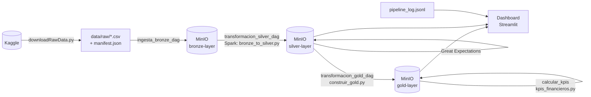
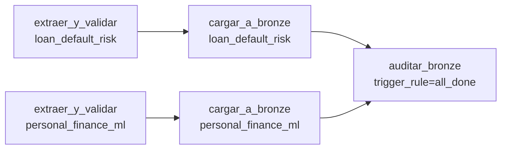
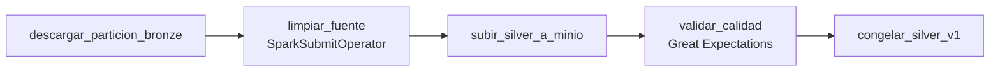
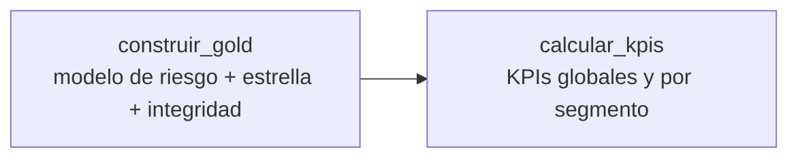
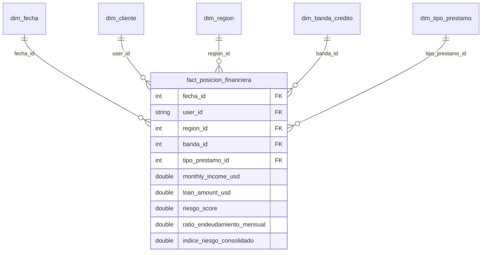

# 01 — Arquitectura

## 1. Visión general

El sistema sigue la **arquitectura Medallion**: cada capa guarda los datos con un nivel de
calidad mayor que la anterior, y ninguna capa se salta.

| Capa | Pregunta que responde | Contenido | Formato |
|---|---|---|---|
| **Bronze** | "¿Qué llegó?" | Copia fiel del CSV original + metadatos de linaje | Parquet + JSON |
| **Silver** | "¿Qué datos son confiables?" | Datos limpios, tipados, deduplicados; los inválidos van a cuarentena | Parquet (`valid/`, `quarantine/`) + JSON de calidad |
| **Gold** | "¿Qué significa para el negocio?" | Modelo estrella, scores de riesgo y KPIs | Parquet + JSON de metadata |



## 2. Componentes (Docker Compose)

| Servicio | Imagen | Puerto(s) | Rol |
|---|---|---|---|
| `postgres` | postgres:15 | — | Base de metadatos de Airflow |
| `airflow-init` | build `Dockerfile` | — | Migra la BD y crea el usuario `airflow` (se ejecuta una vez) |
| `airflow-webserver` | build `Dockerfile` | 8080 | UI de Airflow |
| `airflow-scheduler` | build `Dockerfile` | — | Ejecuta los DAGs (LocalExecutor) |
| `minio` | minio/minio | 9000 (API S3), 9001 (consola) | Data lake (buckets por capa) |
| `spark` | bitnamilegacy/spark | 7077, 8081 (UI) | Spark master |
| `spark-worker` | bitnamilegacy/spark | — | Spark worker |
| `streamlit` | build `Dockerfile.streamlit` | 8501 | Dashboard |

**Imagen de Airflow (`Dockerfile`)**: parte de `apache/airflow:2.9.3` y agrega Java 17 (lo necesita
el driver de Spark) y las librerías del pipeline (pandas, pyarrow, s3fs, providers de Amazon y Spark,
PySpark 4.0, Great Expectations 0.18.19, scikit-learn). Se instalan **al construir la imagen**, no con
`_PIP_ADDITIONAL_REQUIREMENTS`, para no reinstalar en cada arranque.

**Volúmenes compartidos** (host → contenedor):

| Host | Airflow | Spark | Streamlit |
|---|---|---|---|
| `./dags` | `/opt/airflow/dags` | — | — |
| `./scripts` | `/opt/airflow/scripts` | — | — |
| `./config` | `/opt/airflow/config` | — | — |
| `./src/spark` | `/opt/spark-apps` | `/opt/spark-apps` | — |
| `./data` | `/opt/airflow/data` | `/opt/airflow/data` | `/app/data` |

`./data` compartido es clave: Airflow deja el Parquet de Bronze en `data/tmp/silver_staging`
y Spark lo lee desde la misma ruta.

## 3. Organización del almacenamiento (MinIO)

Todas las tablas se **particionan por fecha lógica** (`YYYY/MM/DD`, zona `America/Mexico_City`).

```
bronze-layer/
  <fuente>/YYYY/MM/DD/data.parquet
  <fuente>/YYYY/MM/DD/_ingestion_metadata.json      # linaje: kaggle_id, sha256, filas, fechas

silver-layer/
  <fuente>/YYYY/MM/DD/valid/part-*.parquet          # registros que pasan las reglas
  <fuente>/YYYY/MM/DD/quarantine/part-*.parquet     # registros rechazados + motivo_cuarentena
  <fuente>/YYYY/MM/DD/_calidad_reporte.json         # resultado de Great Expectations
  <fuente>/YYYY/MM/DD/_silver_metadata.json         # "Dataset Silver v1" congelado

gold-layer/
  dim_fecha | dim_cliente | dim_region | dim_banda_credito | dim_tipo_prestamo /YYYY/MM/DD/data.parquet
  fact_posicion_financiera/YYYY/MM/DD/data.parquet
  gold_clientes_riesgo/YYYY/MM/DD/data.parquet
  gold_metricas_por_segmento/YYYY/MM/DD/data.parquet
  gold_kpis_financieros/YYYY/MM/DD/data.parquet
  gold_kpis_por_segmento/YYYY/MM/DD/data.parquet
  _gold_metadata/YYYY-MM-DD.json                    # métricas del modelo + integridad + fuente del pago mensual
```

`<fuente>` ∈ {`loan_default_risk`, `personal_finance_ml`}.

## 4. DAGs de Airflow

Los tres DAGs son `@daily`, `catchup=False` y usan la zona horaria `America/Mexico_City`.
Cada tarea escribe un evento JSON en `data/reports/pipeline_log.jsonl` (log compartido que
alimenta la Vista 1 del dashboard).

### 4.1 `ingesta_bronze_dag` — CSV → Bronze



| Tarea | Qué hace |
|---|---|
| `extraer_y_validar` | Lee el CSV, valida que existan las columnas esperadas (si faltan: `AirflowFailException`, sin reintentos), toma `sha256` y `kaggle_id` del `manifest.json`. |
| `cargar_a_bronze` | Sube `data.parquet` + `_ingestion_metadata.json` a la partición de la fecha lógica. Backend configurable (`BRONZE_BACKEND=minio` o `local`). |
| `auditar_bronze` | Corre **siempre** (`all_done`), aunque falle una ingesta: verifica que cada partición tenga sus 2 archivos. Falla si hay particiones incompletas. |

Resiliencia: `retries=3`, `retry_delay=5 min` y `on_failure_callback=alertar_fallo`, que registra un evento `ALERTA` al agotar reintentos.

### 4.2 `transformacion_silver_dag` — Bronze → Silver


(una cadena por fuente, en paralelo)

| Tarea | Qué hace |
|---|---|
| `descargar_particion_bronze` | Baja el Parquet de Bronze a `data/tmp/silver_staging` (volumen compartido con Spark). |
| `limpiar_<fuente>` | `spark-submit` de `bronze_to_silver.py`: tipado, reglas, deduplicación y separación `valid`/`quarantine`. Driver en Airflow, executors en el clúster. |
| `subir_silver_a_minio` | Borra lo que hubiera en el prefijo y sube el resultado → **idempotente** (re-ejecutar no duplica archivos). |
| `validar_calidad` | Genera el Expectation Suite desde `silver_schema.yml` y valida `valid/`. **No bloquea** el pipeline: reporta (`INFO`/`ALERTA`) y guarda `_calidad_reporte.json`. |
| `congelar_silver_v1` | Escribe `_silver_metadata.json` con versión `silver_v1`, fecha de congelamiento y resultado de calidad. |

### 4.3 `transformacion_gold_dag` — Silver → Gold → KPIs



| Tarea | Qué hace |
|---|---|
| `construir_gold` | 1) Entrena el modelo de riesgo con `loan_default_risk`; 2) califica a los clientes de `personal_finance_ml`; 3) construye el **modelo estrella** y **valida integridad** (falla si hay FK huérfanas o PK duplicadas); 4) escribe las tablas Gold y `_gold_metadata`. |
| `calcular_kpis` | Lee el modelo estrella, calcula 35 KPIs (con semáforo) y los KPIs por segmento. Registra el evento como `INFO` aunque haya KPIs en alerta (una alerta de negocio no es una falla del pipeline). |

Gold usa **pandas, no Spark**: ~32 K filas no justifican el costo de un job distribuido (ver [06](06_decisiones_y_deuda_tecnica.md)).

## 5. Modelo analítico (Gold) — esquema estrella



- **Grano del hecho**: un renglón por cliente por fecha de partición (snapshot).
- **Dimensiones**: guardan cada atributo descriptivo una sola vez.
- **Reglas de integridad** (validadas antes de escribir): PK únicas y no nulas, 0 FK huérfanas,
  grano `(user_id, fecha_id)` único.

Detalle de columnas en [03 — Diccionario de datos](03_diccionario_datos.md).

## 6. Observabilidad

| Mecanismo | Dónde | Para qué |
|---|---|---|
| Log estructurado JSON Lines | `data/reports/pipeline_log.jsonl` | Un evento por tarea (nivel, fuente, partición, duración, resultado). Base de la Vista 1. |
| Alertas por fallo | `on_failure_callback` (ingesta) | Evento `ALERTA` cuando una tarea agota reintentos. |
| Auditoría de Bronze | `auditar_bronze` / `scripts/bronzeHealth.py` | Particiones incompletas o con huecos de fechas. |
| Reportes de calidad | `_calidad_reporte.json` (Silver) | Expectativas cumplidas / fallidas por partición. |
| Integridad de Gold | `_gold_metadata/*.json` | 11 chequeos del modelo estrella + métricas del modelo. |
| Dashboard | Streamlit, 4 vistas | Salud de la malla, calidad, riesgo de crédito y KPIs. |

## 7. Dashboard (Streamlit)

| Vista | Fuente | Contenido |
|---|---|---|
| Resumen ejecutivo | Todas | Frases generadas con los datos actuales (no texto fijo). |
| 1 — Salud de la malla | `pipeline_log.jsonl` | Eventos por día y por tarea, tasa de éxito, últimas alertas. |
| 2 — Calidad de datos | `_calidad_reporte.json` | % de expectativas cumplidas por partición y fuente, umbral 95%. |
| 3 — Riesgo de crédito | `gold_clientes_riesgo`, `gold_metricas_por_segmento`, `_gold_metadata` | Accuracy/AUC, % riesgo alto por banda, top 10 clientes. |
| 4 — KPIs financieros | `gold_kpis_financieros`, `gold_kpis_por_segmento` | KPIs de negocio, semáforo, riesgo, exposición y comportamiento; tabla por segmento. |

`dashboard/data_loader.py` separa la lectura de datos de la interfaz (`app.py`), y los datos se
cachean 30 s con `st.cache_data`.
